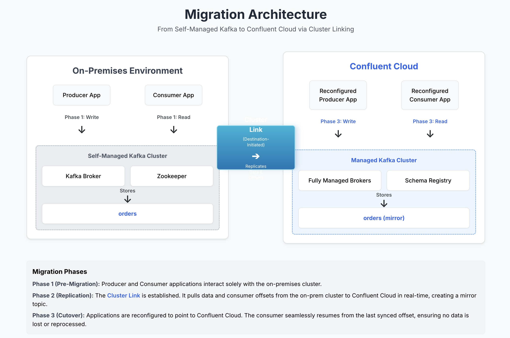

# <div align="center">Data Migration from Apache Kafka to Confluent Cloud</div>
<br>

This repository provides a demonstration of migrating data from Open Source Kafka to Confluent Cloud using Cluster Linking.

## **Architecture**

<div align="center">
    
</div>


<br>


## Prerequisites

Before you begin, ensure you have the following installed:

- **Confluent Cloud Account**
    - Sign-up for a Confluent Cloud account [here](https://www.confluent.io/confluent-cloud/tryfree/)
    - Once you have signed up and logged in, click on the menu icon at the upper right hand corner, click on "Billing & payment", then enter payment details under “Payment details & contacts”. A screenshot of the billing UI is included below.

    > **Note:** You will create resources during this workshop that will incur costs. When you sign up for a Confluent Cloud account, you will get free credits to use in Confluent Cloud. This will cover the cost of resources created during the workshop. More details on the specifics can be found [here](https://www.confluent.io/confluent-cloud/tryfree/).

- [Terraform](https://www.terraform.io/downloads.html) - v1.5.7 or later. 
- [AWS CLI](https://aws.amazon.com/cli/) configured with appropriate credentials.
- [Kafka CLI (Optional)](https://kafka.apache.org/downloads) 
- [Confluent CLI (Optional)](https://docs.confluent.io/confluent-cli/current/install.html) - If on MAC run `brew install confluentinc/tap/cli`. 

<details>
<summary>Installing prerequisites on MAC</summary>

Install the prerequisites by running:

```bash
brew install git terraform confluentinc/tap/cli awscli
```

Install **Kafka command-line interface (CLI)** on your laptop without running a local Kafka server.

1. Download the Kafka binaries:

    ```
    cd /$HOME
    curl -O https://downloads.apache.org/kafka/3.9.0/kafka_2.13-3.9.0.tgz
    tar -xzf kafka_2.13-3.9.0.tgz
    mv kafka_2.13-3.9.0 kafka
    ```

2. Configure Your System's PATH:

    2.1. Open your shell profile file. This is typically `~/.zshrc` for Zsh (the default on modern macOS) or `~/.bash_profile` or `~/.bashrc` for Bash.

    2.2. Add the following line to the end of the file.

    ```
    export PATH="$PATH:$HOME/kafka/bin"
    ```

    2.3. Apply the changes by restarting your terminal or running `source ~/.zshrc` (or the appropriate file for your shell).


</details>

<details>
<summary>Installing prerequisites on Windows</summary>

Install the prerequisites by running:

```powershell
winget install --id Git.Git -e
winget install --id Hashicorp.Terraform -e
winget install --id ConfluentInc.Confluent-CLI -e
winget install --id Amazon.AWSCLI -e
winget install --id Microsoft.OpenJDK.17 -e
```

Install **Kafka command-line interface (CLI)** on your laptop without running a local Kafka server.
`
1. Go to the [Apache Kafka downloads](https://kafka.apache.org/downloads) page and find the archive for `2.13-3.9.0`. Download the binary `.tgz` file.
2. Windows doesn't natively handle `.tgz` files well. Use a tool like **7-Zip** to extract the contents. Extract the files to a simple path, like `C:\kafka`.
3. The Kafka CLI scripts for Windows are located in the `bin\windows` directory.

    3.1. Open the "Environment Variables" settings:

       - Press `Win + S` and search for "Edit the system environment variables."

       - Click the "Environment Variables..." button.

    3.2. Edit the Path variable: In the "System variables" section, find and select the `Path` variable, then click "Edit."

    3.3. Add the Kafka `bin\windows` path:

       - Click "New" and paste the full path to the `bin\windows` directory inside your extracted Kafka folder (e.g., `C:\kafka\bin\windows`).

       - Save your changes by clicking "OK" on all the windows.

       - Restart your Command Prompt or PowerShell for the changes to take effect.

</details> 


<br>


## Setup

1. Clone the repository onto your local development machine using `git clone https://github.com/confluentinc/XXXXXXXXXX.git`.
2. Open a terminal window and change directory to the downloaded repository's terraform directory.

   ```
   cd workshop-XXXXXXX-XXXXXXX/terraform
   ```
3. Configure AWS CLI

   If you already have the AWS CLI configured on your machine and pointing to the correct AWS account, you can skip this step.

   If you're using **AWS Workshop Studio**, click on **Get AWS CLI Credentials** to retrieve the necessary access key, secret key, and region. Then, run the following command to configure the CLI:
   <details>
   <summary>Click to expand for MAC</summary>

   ```bash
   export AWS_DEFAULT_REGION="<cloud_region>"
   export AWS_ACCESS_KEY_ID="<AWS_API_KEY>"
   export AWS_SECRET_ACCESS_KEY="<AWS_SECRET>"
   export AWS_SESSION_TOKEN="<AWS_SESSION_TOKEN>"
   ```

   </details>

   <details>
   <summary>Click to expand for Windows CMD</summary>

   ```bash
   set AWS_DEFAULT_REGION="<cloud_region>"
   set AWS_ACCESS_KEY_ID="<AWS_API_KEY>"
   set AWS_SECRET_ACCESS_KEY="<AWS_SECRET>"
   set AWS_SESSION_TOKEN="<AWS_SESSION_TOKEN>"
   ```


   </details>
4. Verify you are using the correct AWS account by running:

   ```
   aws sts get-caller-identity
   ```
   If you are using **AWS Workshop Studio**, you should have an output that looks like this:

   ```bash
   {
    "UserId": "AROA4AFJ7PWFSQYLGZ3YL:Participant",
    "Account": "xxxxxxxxxx",
    "Arn": "arn:aws:sts::xxxxxxxxxx:assumed-role/WSParticipantRole/Participant"
   }
   ```


<br>


## **Objective:**

**Acme.com**, a mid-sized e-commerce company runs a self-managed Open-Source Apache Kafka (OSK) cluster on-premises to handle real-time order events. As their customer base grows, maintaining uptime, scaling storage, and ensuring disaster recovery becomes increasingly challenging. To overcome these limitations and reduce operational overhead, they plan to migrate their data pipeline to Confluent Cloud.

This workshop simulates that scenario by:

- Setting up a local Kafka cluster to act as the on-prem system.
- Producing order events to simulate real-world workloads.
- Establishing a **Destination-Initiated Cluster Link** to pull topics and messages into Confluent Cloud.
- Validating successful data replication.
- Reconfiguring producers and consumers to point to Confluent Cloud, ensuring that consumers pick up from the latest offset post-migration.

By the end, participants will understand the complete migration process and key considerations for moving production workloads to the cloud.


<br>


## <a name="step-1"></a>Step 1: Set up Open-Source Kafka (OSK)

In this section, you will set up an OSK instance on AWS EC2 instance using a Terrform script. Execute the following steps to perform this task:

1. Ensure that you're in the directory of the downloaded GitHub repository within your terminal window. Also, confirm that the following environment variables are set for AWS access:

    ```
    AWS_ACCESS_KEY_ID="<AWS_API_KEY>"
    AWS_SECRET_ACCESS_KEY="<AWS_SECRET>"
    AWS_SESSION_TOKEN="<AWS_SESSION_TOKEN>"
    ```

2. Change directory to `terraform` directory (if not already done):
    ```
    cd terraform
    ```
3. Initialize Terraform

   ```bash
   terraform init
   ```

6. Deploy OSK using Terrform

   ```bash
   terraform apply --auto-approve
   ```

Terraform will take around 10 mins to deploy and initialize OSK on AWS EC2 instance.


<br>


## <a name="step-2"></a>Step 2: Set up Confluent Cloud and Create a Dedicated Cluster

1. Log in to [Confluent Cloud](https://confluent.cloud) and enter your email and password.

<div align="center" padding=25px>
    
</div>

2. If you are logging in for the first time, you will see a self-guided wizard that walks you through spinning up a cluster. Please minimize this as you will walk through those steps in this workshop. 


3. Click **+ Add Environment**. Specify an **Environment Name** and Click **Create**. 

    > ⚠️ **Note:** An environment contains clusters and its deployed components such as Connectors, ksqlDB, and Schema Registry. You have the ability to create different environments based on your company's requirements. Confluent has seen companies use environments to separate Development/Testing, Pre-Production, and Production clusters.
    
    >There is a *default* environment ready in your account upon account creation. You can use this *default* environment for the purpose of this workshop if you do not wish to create an additional environment.

<div align="center" padding=25px>
    
</div>

2. Now that you have an environment, click **Create Cluster**. 

    > ⚠️ **Note:** Confluent Cloud clusters are available in 3 types: Basic, Standard, and Dedicated. Basic is intended for development use cases so you will use that for the workshop. Basic clusters only support single zone availability. Standard and Dedicated clusters are intended for production use and support Multi-zone deployments. If you are interested in learning more about the different types of clusters and their associated features and limits, refer to this [documentation](https://docs.confluent.io/current/cloud/clusters/cluster-types.html).

3. Choose the **Dedicated** Cluster Type. 

<div align="center" padding=25px>
    
</div>

4. Click **Begin Configuration**.
   
5. Choose your preferred Cloud Provider (AWS, GCP, or Azure), Region, and Availability Zone.

6. Make sure the **Internet** option is selected for Networking configuration.

7. Specify a **Cluster Name** - any name will work here. 

<div align="center" padding=25px>
    
</div>

7. View the associated Configuration and Cost, Usage Limits, and Uptime SLA information before launching.

8. Click **Launch Cluster.** The dedicated cluster type takes around 20 - 30 minutes for provisioning.
   


<br>


## <a name="step-3"></a>Step 3: Connect to Open-Source Kafka (OSK) and Produce Messages

In this section, you will SSH into an AWS EC2 instance running a standalone Kafka server. You'll then create a new topic on the Kafka server and use the Kafka CLI tools to produce and consume messages.

1. Change directory to `terraform` directory (if not already done). Run the following command to find the EC2 instance public IP:
   
   ```bash
   terraform output
   ```

   Copy the value of `instance_public_ip`. It should look like this:

   ```
    instance_public_ip = "XX.XX.XX.XX"
   ```

2. Use the following command to connect to the EC2 instance via SSH:

    ```
    ssh -i my-tf-key.pem ec2-user@XX.XX.XX.XX 
    ```

    Replace `XX.XX.XX.XX` with the EC2 instance public IP.

3. Execute the following command to find the cluster ID for an open-source Apache Kafka installation. 

    ```
    kafka-cluster.sh cluster-id --bootstrap-server localhost:9092
    ```

    You’ll see an output like `Cluster ID: xxxxxxxxxxxxxxx`. Make sure to copy it, as you’ll need it later when setting up cluster linking.

    > ⚠️ **Note:** If you see the error **kafka-cluster.sh: command not found** in your terminal, run the following command to update the system PATH environment variable.
    
   ```
    source ~/.bash_profile
   ```

4. Create a topic in OSK using the following command. You will use the `kafka-topics.sh` utility to create the topic:
    
    ```bash
    kafka-topics.sh --create --bootstrap-server localhost:9092 --topic test-topic --partitions 1 --replication-factor 1
    ```

5. Produce some sample data using the `kafka-console-producer.sh` utility.

    ```bash
    kafka-console-producer.sh --bootstrap-server localhost:9092 --topic test-topic
    ```

    Your terminal shows the prompt:

    ```
    >
    ```

    You type your first message and press Enter:

    ```
    > Hello Kafka
    ```

    The message "Hello Kafka" is now published to `test-topic`. The prompt appears again, ready for the next message:

    ```
    > This is a second message.
    ```

    The message "This is a second message." is published. You then press **Ctrl+C** to exit the producer.

6. Consume the messages using the `kafka-console-consumer.sh` utility. Also specify a consumer group - `my-consumer-group`.

    ```
    kafka-console-consumer.sh --bootstrap-server localhost:9092 --topic test-topic --group my-consumer-group --from-beginning
    ```

    Make sure you see both the message you produced in the previous steps.

7. View the consumer group offsets and lag by using the `kafka-consumer-groups.sh` utility. 

    ```
    kafka-consumer-groups.sh --bootstrap-server localhost:9092 --describe --group my-consumer-group
    ```

    The command will produce a table with the following important columns:

    ```
    GROUP             TOPIC           PARTITION  CURRENT-OFFSET  LOG-END-OFFSET  LAG     ...           
    my-consumer-group test-topic      0          2               2               0       ...
    ```

    A brief explanation of the columns:

    - **CURRENT-OFFSET**: The last offset that the consumer group has successfully committed. This is the position where the consumer will resume reading from if it restarts.

    - **LOG-END-OFFSET**: The offset of the newest message written to the partition. This is also known as the "High Watermark".

    - **LAG**: The difference between LOG-END-OFFSET and CURRENT-OFFSET. This is the number of messages the consumer group has yet to consume. A high or consistently growing lag indicates that your consumers are not keeping up with the producers.    


<br>


## <a name="step-4"></a>Step 4: Set up Cluster Linking on Confluent Cloud

With the prerequisites in place, you can now proceed with configuring the Cluster Link. The process involves creating a link on the destination (Confluent Cloud) that points to your source (open-source Kafka) cluster.

To set up Cluster Linking in Confluent Cloud, follow these steps:

1. Log in to the Confluent Cloud Console and select **Cluster links** from the menu on the left.
2. Click **Create cluster link**.
3. In the Source Cluster configurations:

   	3.1. Select **Confluent Platform or Apache Kafka** as the Source Cluster.
   
   	3.2. Enter the source cluster ID (the cluster ID of your OSK instance that you copied earlier).
   
   	3.3. Uncheck the **Source initiated connection** in the Security access section and provide the Bootstrap server URL of your OSK (`<instance_public_ip>:9092`).
   
4. In the Destination Cluster configurations, select your environment and the dedicated cluster that you created previously.
5. In the Configuration page:

   5.1. Select **Enable for all existing and future source cluster topics** option in the Auto-create mirror topics section.

   5.2. Select **Sync all existing and future consumer groups** option in the Sync consumer offsets section.

6. Enter a Cluster link name, review your configurations, and click **Launch Cluster Link**.  


<br>


## <a name="step-5"></a>Step 5: Verifying the Creation of the Mirror Topic in the Dedicated Cluster

To verify creation of the mirror topics, execute the following steps:

1. Log into Confluent Cloud using the Confluent CLI. The CLI is already installed in the AWS EC2 instance. Connect to the EC2 instance using SSH and execute the following commands:

    1.1. Login to Confluent Cloud:

    ```
    confluent login --no-browser
    ```

    If you belong to multiple Confluent Cloud organizations, include the `--organization` option during login to access the specific organization that contains your dedicated Kafka cluster.

    1.2.  First, it's helpful to see which clusters are available in your current environment. This command will show you a list of your clusters along with their IDs.

    ```
    confluent kafka cluster list
    ```

    <br>

    <details>
    <summary>Click if you have multiple Confluent Cloud environments</summary>

       1. List your environments:

        `confluent environment list`
        
       2. Switch to a different environment:

        `confluent environment use <environment-id>`

       3. List clusters within that environment:

        `confluent kafka cluster list`
    </details>

    <br>

    1.3. Identify the cluster ID for your dedicated Kafka cluster and set it as your default for the session.

    ```
    confluent kafka cluster use <cluster-id>
    ```


2. To list all the mirror topics associated with the link, use the following command:

```bash
confluent kafka mirror list
```

3. To check the status and details of a specific mirror topic, execute the following command:

```bash
confluent kafka mirror describe <MIRROR-TOPIC-NAME> --link <CLUSTER-LINK-NAME>
```
Look for the status to ensure it is in an active state and pulling records from the source.

4. You can also verify that data is being replicated properly by monitoring the lag and message count in the mirror topic using the following command:

```bash
confluent kafka topic describe <MIRROR-TOPIC-NAME>
```
Check the estimated lag and ensure it reflects minimal delays, indicating that records are being pulled promptly from OSK.


<br>


## <a name="step-6"></a>Step 6: Make the Mirror Topic Writable

The mirror topics are read-only by default. To make a mirror topic writable (i.e., change it from read-only, mirrored state to a regular, independent, writable topic) in Confluent Kafka (whether in Confluent Platform or Confluent Cloud with Cluster Linking), you need to use either the promote or failover command. This operation is commonly called “promoting” the mirror topic, and is an essential step in cutover, DR, or migration workflows.

> ⚠️ **Note:** Mirror topics are read-only topics created and owned by a cluster link. You cannot directly write to these topics; only the cluster link can synchronize data from the source topic. To make the topic writable, you must “convert” it to a regular topic by stopping (detaching) it from the cluster link. This is done by either promoting or failing over the topic. Once promoted or failed over, the mirror topic will permanently stop syncing from its source, and you can produce records to it like any other topic. This operation cannot be reversed—you would need to recreate the topic as a mirror topic if you want to re-establish mirroring.

Execute the following steps to make the mirror topic writable:

1. Confirm the current status of the mirror topic (and check that mirroring lag is zero if doing a planned migration).

```bash
confluent kafka mirror describe <mirror-topic-name> --link <link-name>
```

For promote, ensure network reachability between the destination and source clusters, and that lag is zero.

2. Promote the mirror topic.

```bash
confluent kafka mirror promote <mirror-topic-name> --link <link-name> --cluster <destination-cluster-id>
```

This will check lag, synchronize everything, and make the topic writable only if fully caught up.

> ⚠️ **Note:** 
>
> **Promote**: Use when both the source and destination clusters are healthy and there is no mirroring lag. The promote command guarantees that the mirror topic is fully caught up and all relevant metadata (including consumer offsets) is synchronized from source to mirror before making it writable. This is the recommended operation for planned cutovers or migrations. 
> 
> **Failover**: Use if the source cluster is unavailable or in disaster scenarios. The failover command will forcibly convert the mirror topic to a writable topic regardless of synchronization status (which may result in some data or offset lag).
Both commands must be executed on the destination cluster—the cluster hosting the mirror topic.

3. Validate that the topic is now writable by producing new records. For example, execute the following command:

```bash
kafka-console-producer.sh --bootstrap-server <confluent-cloud-kafka-broker>:9092 --topic <mirror-topic-name>
```

4. Check topic state. The topic state will be STOPPED when it is writable (no longer mirroring).

```bash
confluent kafka mirror describe <mirror-topic-name> --link <link-name>
```

<br>


## <a name="step-7"></a>Step 7: Create an API Key Pair for Accessing Comfluent Cloud Kafka

1. Select **API keys** on the left sidebar menu. 
2. If this is your first API key within your cluster, click **Create key**. If you have set up API keys in your cluster in the past and already have an existing API key, click **+ Add key**.
    <div align="center" padding=25px>
       
    </div>

3. Select **My Account**, then click Next. Give it a description and click **Download and continue**
4. Save your API key and secret - you will need these during the workshop.


<br>


## <a name="step-8"></a>Step 8: Produce and Consume Data from Confluent Cloud

In this section, you will migrate your producer and consumer to write and read from Confluent Cloud Kafka cluster.

1. In your terminal window, set `CC-KAFKA-BROKER` environment variable to point your Confluent Cloud Kafka cluster:
    ```
    export CC-KAFKA-BROKER=xxxxxxxxx-xxxxxxxx-xxxxxxx
    ```

2. Produce some sample data using the `kafka-console-producer.sh` utility. Ensure to replace **<CC-KAFKA-BROKER>**, **<CC-API-KEY>**, and **<CC-API-SECRET>** with actual values before executing the command: 

    ```bash
    kafka-console-producer \
    --bootstrap-server <CC-KAFKA-BROKER>:9092 \
    --topic test-topic \
    --producer-property security.protocol=SASL_SSL \
    --producer-property sasl.mechanism=PLAIN \
    --producer-property "sasl.jaas.config=org.apache.kafka.common.security.plain.PlainLoginModule required username=\"<CC-API-KEY>\" password=\"<CC-API-SECRET>";"
    ```

    Your terminal shows the prompt:

    ```
    >
    ```

    You type your first message and press Enter:

    ```
    > Hello from Confluent Cloud
    ```

    The message "Hello Kafka" is now published to `test-topic`. The prompt appears again, ready for the next message:

    ```
    > This is a new message added.
    ```

    The message "This is a new message added" is published. You then press **Ctrl+C** to exit the producer.

3. Consume the messages using the `kafka-console-consumer.sh` utility.

    ```bash
    kafka-console-consumer \
    --bootstrap-server <CC-KAFKA-BROKER>:9092 \
    --topic test-topic \
    --consumer-property security.protocol=SASL_SSL \
    --consumer-property sasl.mechanism=PLAIN \
    --consumer-property "sasl.jaas.config=org.apache.kafka.common.security.plain.PlainLoginModule required username=\"<CC-API-KEY>\" password=\"<CC-API-SECRET>\";"
    ```

    Make sure you see four messages. The one created on Confluent Kafka as well as OSK.

6. View the consumer group offsets and lag by using the `kafka-consumer-groups.sh` utility. 

    ```bash
    kafka-consumer-groups \
    --bootstrap-server <CC-KAFKA-BROKER>:9092 \
    --describe \
    --group my-consumer-group \
    --consumer-property security.protocol=SASL_SSL \
    --consumer-property sasl.mechanism=PLAIN \
    --consumer-property "sasl.jaas.config=org.apache.kafka.common.security.plain.PlainLoginModule required username=\"<CC-API-KEY>\" password=\"<CC-API-SECRET>\";"
    ```

    The command will produce a table with the following important columns:

    ```
    GROUP             TOPIC           PARTITION  CURRENT-OFFSET  LOG-END-OFFSET  LAG     ...           
    my-consumer-group test-topic      0          2               2               0       ...
    ```

7. Consume only the new messages by specifying the consumer group.

    ```bash
    kafka-console-consumer \
    --bootstrap-server <CC-KAFKA-BROKER>:9092 \
    --topic test-topic \
    --group my-consumer-group \
    --consumer-property security.protocol=SASL_SSL \
    --consumer-property sasl.mechanism=PLAIN \
    --consumer-property "sasl.jaas.config=org.apache.kafka.common.security.plain.PlainLoginModule required username=\"<CC-API-KEY>\" password=\"<CC-API-SECRET>\";"
    ```

    You see that the consumer from `my-consumer-group` starts consuming only the new messages from Confluent Kafka.


<br>


> ⚠️ **Note:** Make sure to delete all the resources created if you no longer wish to use the environment.

## <a name="step-8"></a>Confluent Resources and Further Testing

* [Confluent Cloud Documentation](https://docs.confluent.io/cloud/current/overview.html)

* [Confluent Connectors](https://www.confluent.io/hub/) - A recommended next step after the workshop is to deploy a connector of your choice.

* [Confluent Cloud Schema Registry](https://docs.confluent.io/cloud/current/client-apps/schemas-manage.html#)

* [Best Practices for Developing Apache Kafka Applications on Confluent Cloud](https://assets.confluent.io/m/14397e757459a58d/original/20200205-WP-Best_Practices_for_Developing_Apache_Kafka_Applications_on_Confluent_Cloud.pdf) 

* [Confluent Cloud Demos and Examples](https://docs.confluent.io/platform/current/tutorials/examples/ccloud/docs/ccloud-demos-overview.html)

* [Kafka Connect Deep Dive – Error Handling and Dead Letter Queues](https://www.confluent.io/blog/kafka-connect-deep-dive-error-handling-dead-letter-queues/)
